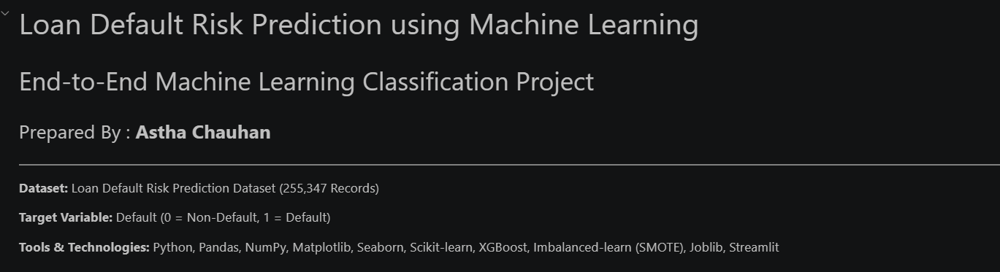
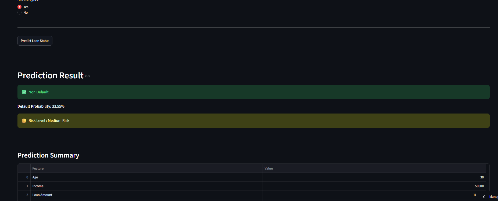
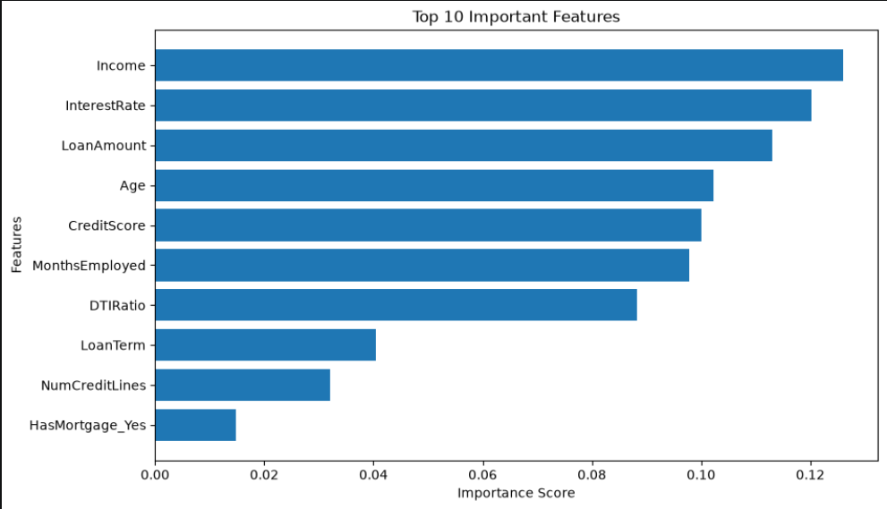
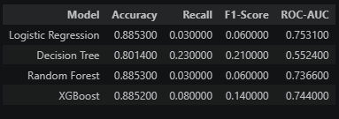

# Loan Default Risk Prediction using Machine Learning



An end-to-end Machine Learning Classification project that predicts whether a borrower is likely to default on a loan using customer financial, demographic, and credit-related information.

## Live Demo

Streamlit App:
[Loan Default Risk Prediction App](https://loan-default-risk-prediction-ml-app.streamlit.app)




---

# Project Overview

Loan default is one of the biggest challenges for banks and financial institutions. Approving loans for high-risk customers can result in financial losses.

This project uses Machine Learning techniques to identify customers who are more likely to default before loan approval. Multiple classification models are trained, evaluated, and compared to determine the most suitable model for loan default prediction.

---

# Project Objectives

- Predict loan default risk using Machine Learning.
- Perform Exploratory Data Analysis (EDA).
- Preprocess the dataset for model training.
- Compare multiple classification algorithms.
- Handle class imbalance using SMOTE.
- Evaluate models using different performance metrics.
- Identify important features affecting loan default.
- Save the trained model for future prediction.
- Build a Streamlit web application.

---

# Dataset Information

| Attribute | Value |
|------------|-------|
| Dataset | Loan Default Risk Prediction Dataset |
| Records | 255,347 |
| Features | 18 (Before Encoding) |
| Problem Type | Binary Classification |
| Target Variable | Default |

Target Variable

- **0 → Non Default**
- **1 → Default**

---

# Technologies Used

- Python
- Pandas
- NumPy
- Matplotlib
- Seaborn
- Scikit-learn
- XGBoost
- Imbalanced-learn (SMOTE)
- Joblib
- Streamlit
- Jupyter Notebook
- Git & GitHub

---

# Machine Learning Models

- Logistic Regression
- Decision Tree
- Random Forest
- XGBoost

---

# Machine Learning Workflow

```
Business Understanding
        ↓
Data Collection
        ↓
Data Understanding
        ↓
Data Cleaning
        ↓
Exploratory Data Analysis
        ↓
Feature Engineering
        ↓
Data Preprocessing
        ↓
Train-Test Split
        ↓
Feature Scaling
        ↓
Model Building
        ↓
Model Evaluation
        ↓
Model Comparison
        ↓
SMOTE
        ↓
Feature Importance
        ↓
Model Saving
        ↓
Prediction
```

---

# Model Performance

| Model | Accuracy | ROC-AUC |
|--------|----------|----------|
| Logistic Regression | 88.53% | 0.7531 |
| Decision Tree | 80.14% | 0.5524 |
| Random Forest | 88.53% | 0.7366 |
| XGBoost | 88.52% | 0.7440 |

---

# Handling Class Imbalance

The dataset is highly imbalanced.

Before training the final model, **SMOTE** (Synthetic Minority Oversampling Technique) was applied to balance the minority class and improve the model's ability to identify loan defaulters.

---

# Feature Importance

The most influential features are:

- Income
- Interest Rate
- Loan Amount
- Credit Score
- Age
- Months Employed
- DTI Ratio
- 



## Model Comparison



---

# Project Structure

```
Loan_Default_Risk_Prediction/

│── data/
│   └── Loan_default_dataset.csv

│── images/
    ├── project_cover.png
    ├── dataset_preview.png
    ├── dataset_information.png
    ├── target_distribution.png
    ├── correlation_heatmap.png
    ├── model_comparison.png
    ├── feature_importance.png
    └── prediction_result.png     

│── notebooks/
│   ├── Loan_Default_Risk_Prediction.ipynb
│   └── loan_default_rf_model.pkl

│── app.py

│── requirements.txt

│── README.md
```

---

# Installation

Clone the repository

```bash
git clone https://github.com/your-username/Loan_Default_Risk_Prediction.git
```

Go to project directory

```bash
cd Loan_Default_Risk_Prediction
```

Install dependencies

```bash
pip install -r requirements.txt
```

Run the Streamlit application

```bash
streamlit run app.py
```

---

# Project Screenshots

- project cover
- Dataset Preview
- Target Distribution
- Correlation Heatmap
- Model Comparison
- Feature Importance
- Prediction Result
- Streamlit Application

---

# Future Scope

- Hyperparameter Tuning
- Cross Validation
- Deep Learning Models
- Explainable AI (SHAP)
- Real-Time Prediction API
- Cloud Deployment
- Integration with Banking Systems

---

# Author

**Astha Chauhan**

BCA Student | Aspiring Data Scientist

GitHub: [aasthachauhan289](https://github.com/aasthachauhan289) 

LinkedIn: [Astha Chauhan](https://www.linkedin.com/in/astha-chauhan-001aa832a/)

Email: chauhanaastha289@gmail.com

Streamlit App: [Loan Default Risk Prediction App](https://loan-default-risk-prediction-ml-app.streamlit.app)

---
